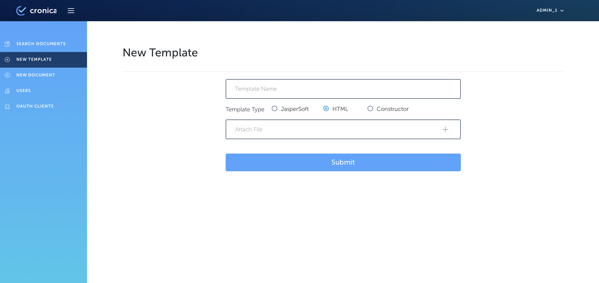
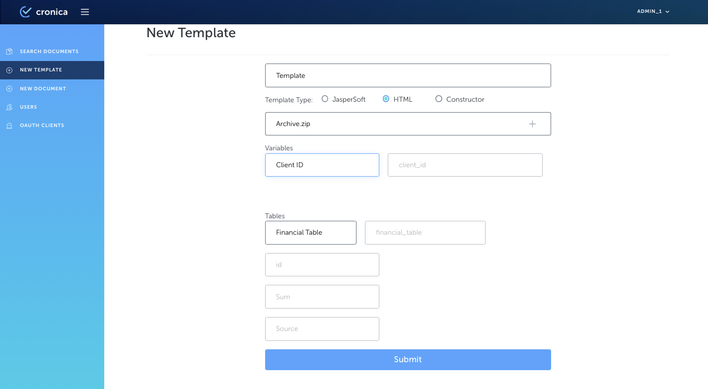

# How to add HTML Template to Cronica.io

Step-by-step guide

**1.   Create html document with any suitable for you html editor, adding images, styles and tables.**

**2.  Put all used images into “../template/img” folder**


3.  Open .html document to make next changes with code:

**Change file location for images to just file name:
Before: 

```php

```

After:

```php

```

**Insert variables to any place of html within <p>, <span>, <div> tags by adding ‘ ###variable_name###’:
  
Before:
  
```php
  <p style="text-align: center;">Declaration of Mr.Smith</p>
```

After:
```php
<p style="text-align: center;">Declaration of ###name###</p>
```
**Insert “data-tablename” parameter with the table name to table tags:

Before: 

```php
<table style="height: 17px; margin-left: auto; margin-right: auto;" width="631">
```

After: 

```php
<table data-tablename="new_table" style="height: 17px; margin-left: auto; margin-right: auto;" width="631">
```

**Add name for the columns within <td> tags:
  
Before: 

```php
<<td style="width: 88px;"></td>
<td style="width: 88px;"></td>
```

After: 

```php
<td style="width: 88px;">id</td>
<td style="width: 88px;">Sum</td>
```

**4. Save .html file**

**5. Compress .html file and “template” folder to single .zip archive**

**6. Go to the Issuer site of Cronica.io and authorize as an Editor or Administrator**

**7. Go to the New Template**

**8. Input Template Name**

**9. Click on HTML button**



**10. Click on 'Submit' button**

**11. Observe block with variable and table name(s)**



**11. Complete Variable Name fields (f.e. "Client ID")**

**12. Complete Table Name fields (f.e. "Financial Table")**

**13. If your template has more than one table, complete Table Name field for each table**

**14. Check all the fields are correctly completed and click on Submit to submit new template**

**15. Observe newly added template in documents list in New Document menu**


