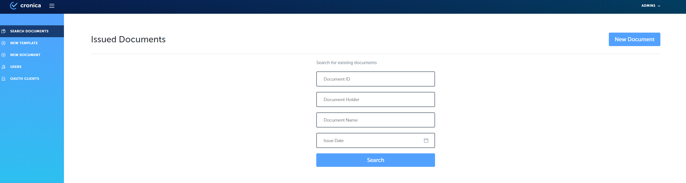
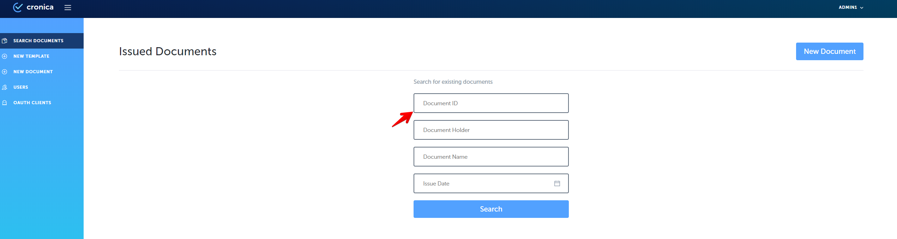
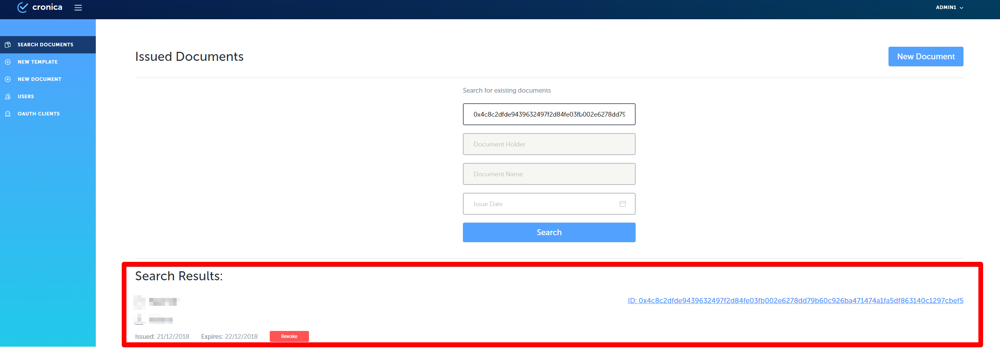

# Step-by-step guide

**1. Go to the Issuer site of Cronica.io and authorize;**

**2. Click on 'Search document' button on the left side menu;**

**3. Observe document search screen;**    

**4. Insert ID in the "Document ID"**

**5. At the bottom of our page we get the search result**

**6. By clicking on the document ID, the pdf document is displayed.**

