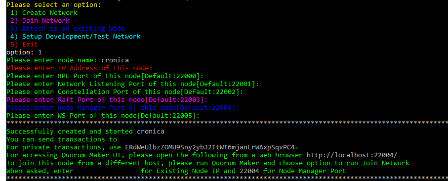
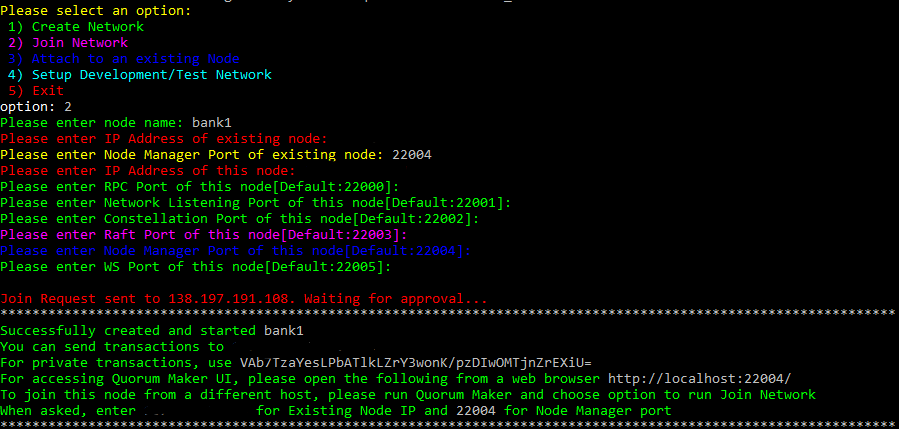
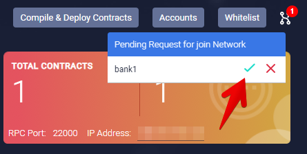
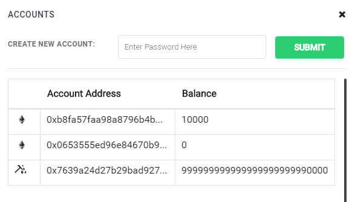

#  Minimal requirements for server hardware and software:

**Instance type: t3.micro, t2/t3 unlimited
Storage: EBS volume 200 GB (SSD, GP2)**

## How to configure first node:

1. Connect to the virtual machine based on _Ubuntu 16.04_ with preinstalled:

**sudo apt-get update -y**

**sudo apt-get install docker.io docker-compose -y;**

**sleep 2; sudo usermod -a -G docker ubuntu**

**docker info**

**docker-compose --version**

1.1 **git clone** [**https://github.com/cronicaio/quorum-maker.git**](https://github.com/cronicaio/quorum-maker.git)

1.2 Enter directory of Quorum-Maker service - **$ cd quorum-maker**

1.3 Run setup script - **$ ./setup.sh**

 2.Set the network parameters, as described below:

2.1 _Select  &quot;Create new network&quot;_ - enter &quot; **1**&quot; and press [**Enter**]

2.2 _Input the name of the node_ - Type   **node\_name** and press [**Enter**]

2.3 _Input IP address of this node_ - Type **first\_node\_ip\_address** (IP address of the current server) and press [Enter]

2.4 _Input RPC Port of this node_ - Type **rpc\_port\_number** or press [**Enter**] for default [Default:22000]

2.5 _Input Network Listening Port_ - Type **network\_listening\_port\_number** or press [**Enter**] for default [Default:22001]

2.6 _Input Constellation Port_ - Type **constellation\_port\_number** or press [**Enter**] for default [Default:22002]

2.7 _Input Raft Port_ - Type **raft\_port\_number** or press [**Enter**] for default [Default:22003]

2.8 _Input Node Manager Port_ - Type **node\_manager\_port\_number** or press [**Enter**] for default [Default:22004]: &quot;22004&quot;

2.9 _Input WS Port of current node -_ **Type WS\_node\_port** or press [**Enter**] for default [Default:22005]: &quot;22005&quot;

_Node configuration screen example for configuration of first node_

3. Observe success message

4. Your node started at **http://first\_node\_server\_ip\_address:22004**

_if you&#39;ll need to restart node after stop, follow next steps:_

1. _Go to node service directory on your server_ - **$**  **cd ./{node\_name}**
2. _Run node execution script -_ **$ .**** /start.sh**

## How to configure second and other nodes:

1. Connect to the virtual machine based on _Ubuntu 16.04_ with preinstalled:

1.1 **git clone** [**https://github.com/cronicaio/quorum-maker.git**](https://github.com/cronicaio/quorum-maker.git)

1.2 Enter directory of Quorum-Maker service - **$ cd quorum-maker**

1.3 Run setup script - **$ ./setup.sh**

2. Set the network parameters, as described below:

_2.1 Select  &quot;Join network&quot;_ - enter &quot; **2**&quot; and press [**Enter**]

_2.2 Input the name of the node_ - Type   **node\_name** and press [**Enter**]

_2.3 Input IP Address of first node_ - Type **first\_node\_ip\_address** (IP address of the existing) and press [Enter]

_2.4 Input Node Manager Port of first node_ - Type **node\_manager\_port\_number** or press [**Enter**] for default [Default:22004]

_2.5 Input IP Address of current node_ - Type **current\_node\_ip\_address** (IP address of the existing) and press [Enter]

_2.6 Input Network Listening Port of current node_ - Type **network\_listening\_port\_number** or press [**Enter**] for default [Default:22001]

_2.7 Input Constellation Port of current node_ - Type **network\_listening\_port\_number** or press [**Enter**] for default [Default:22002]

_2.8 Input Raft Port of current node_ - Type **raft\_port\_number** or press [**Enter**] for default [Default:22003]

_2.9 Input Node Manager Port_ of current node - Type **node\_manager\_listening\_port\_number** or press [**Enter**] for default [Default:22004]: &quot;22004&quot;

_2.10 Input WS Port of current node -_ **Type WS\_node\_port** or press [**Enter**] for   default [Default:22005]: &quot;22005&quot;

_Node configuration screen example for joining network node_

3. Go to **http://first\_node\_server \_ip\_address** : **22004** and accept second node via web interface.

4. Observe notification of successful connection in the node manager web interface of first node

5. Your node started at **http://first\_node\_server\_ip\_address:22004**

_if you&#39;ll need to restart node after stop, follow next steps:_

1. _Go to node service directory on your server_ - **$**  **cd ./{node\_name}**
2. _Run node execution script -_ **$ .**** /start.sh**

**Accounts**** :**

1. Go to the site 1 node **http://first\_node\_server\_ip\_address:22004**

1.1 Press button &quot;Accounts&quot;

1.2 To create a new account you need to come up with a password and click the &quot;Submit&quot; button
  

1.3 After that the new account appears in the list with the generated key and your password

1.4 After creating an account, you should refill it

2. Connect to our 1 node:

**$ ssh root@first\_node\_server\_ip\_address**

3. Download geth client (binary file):
**cd**

**mkdir geth\_binary**

**cd geth\_binary**

**wget** [**https://gethstore.blob.core.windows.net/builds/geth-linux-amd64-1.8.15-89451f7c.tar.gz**](https://gethstore.blob.core.windows.net/builds/geth-linux-amd64-1.8.15-89451f7c.tar.gz)

**tar xvzf geth-linux-amd64-1.8.15-89451f7c.tar.gz**

**cd geth-linux-amd64-1.8.15-89451f7c**

**cp ./geth ~/geth**

**cd**

**rm -r geth\_binary**

3.1 Attach to the node using command:

**~/geth**  **attach ~/quorum-maker/cronica/node/qdata/geth.ipc**

Where **~/quorum-maker/cronica/node/qdata/geth.ipc** - path to geth.ipc interface

3.1.1 Now you should unlock the main account for the transfer to the one we the created accounts

**$ web3.personal.unlockAccount(eth.coinbase)**

3.1.2 The message about successful unlock should be displayed

3.2 Then you can transfer funds to our created account, Green Vision key transaction

**$ eth.sendTransaction({from:eth.coinbase, to:&quot;0xb8fa57faa98a8796b4b527214bdafd23b8426470&quot;, value:10000})**

3.3 Detailed information about our transaction should be displayed

**$  eth.getTransactionReceipt(&quot;enter the transaction key&quot;)**
